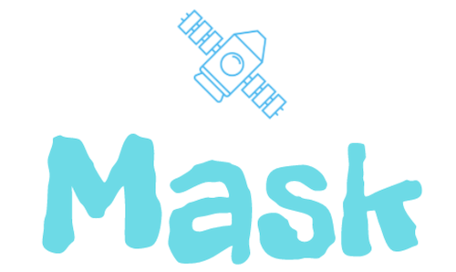

Welcome to mask's document. This framework is designed to build a gRpc server just like `Flask` which is a http server.
from this document, you will learn how to use mask in your project.

User's Guide
================

.. toctree::
   :maxdepth: 2
   :caption: Contents:

